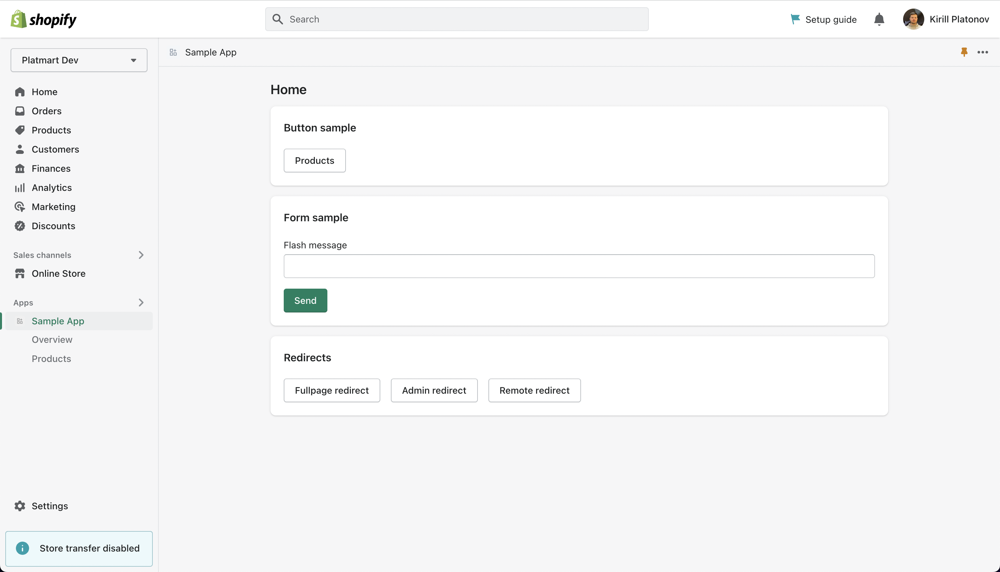

# Shopify Hotwire Sample

The sample app includes:
- JWT integration for [Hotwire Turbo](https://turbo.hotwired.dev/)
- JWT integration for [Rails Request.JS](https://github.com/rails/request.js)
- Integration with AppBridge 3.x
- [Polaris ViewComponents](https://github.com/baoagency/polaris_view_components)
- [Hotwire::Livereload](https://github.com/kirillplatonov/hotwire-livereload)

Since the `shopify_app` gem is not fully compatible with App Bridge 2 this sample uses fork.



> The old App Bridge 1 sample can be found in `app-bridge-1` branch.
> The old App Bridge 2 sample can be found in `app-bridge-2` branch.

## Dependencies

- Redis
- Postgres

## OAuth Tunnel in Development

In order to redirect OAuth requests securely to localhost, you'll need to setup a tunnel to redirect from the internet to localhost.

To do that, you can [install the `cloudflared` CLI tool](https://developers.cloudflare.com/cloudflare-one/connections/connect-apps/install-and-setup/installation/), and run:

```shell
# Note that you can also use a different port
cloudflared tunnel --url http://localhost:3000
```

You will need to keep this window running to maintain the tunnel during development.

For more advanced tunnel setup check out article [Setting up Cloudflare Tunnel for development](https://kirillplatonov.com/posts/setting-up-cloudflare-tunnel-for-development/).

## Quick start

To run this sample locally, you can clone this repository and do the following.

1. Create a new app in your Shopify Partner account unless you already have one.

2. Connect to Shopify:

```shell
shopify app connect
```

It will generate `.env` file with Shopify API credentials.

3. Add `HOST` with your cloudflare tunnel to `.env` file:

```
HOST=https://<Your tunnel host>
```

4. Update your app URLs in the Shopify Partner dashboard to point to your tunnel.

Set the `App URL` to `https://<your tunnel host>/` and the `Allowed redirection URL(s)` to `https://<your tunnel host>/auth/shopify/callback`.

5. Setup Rails app:

```shell
bin/setup
```

6. Start the app:

```shell
bin/dev
```

7. Install and open this app on a development shop.
